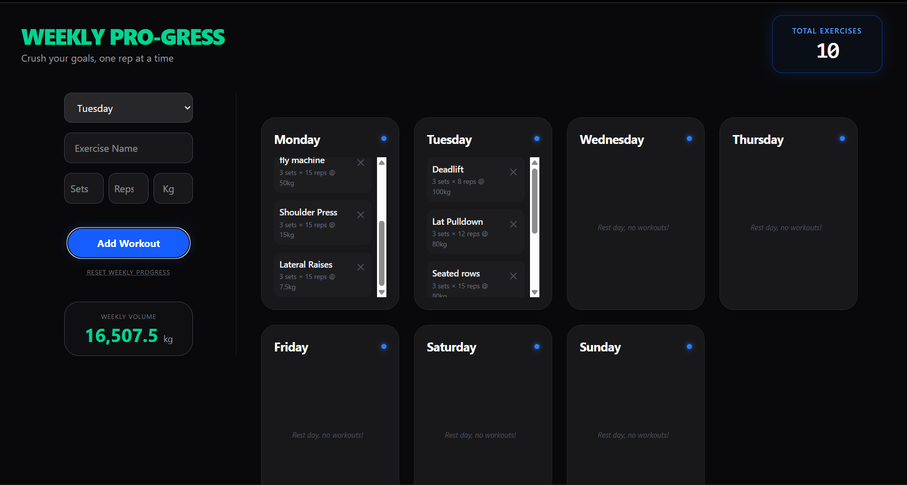

# 💪 Gym Tracker

A simple React-based workout tracking application that allows users to log exercises and monitor their weekly progress.

---

## 🧠 Overview

Gym Tracker is built to help users maintain consistency in their workouts by providing a structured way to log exercises, track sets/reps, and monitor weekly activity.

---

## ✨ Features

* Add, edit, and delete workout entries
* Track sets, reps, and weight
* Weekly workout organization
* Total exercises counter
* Weekly volume calculation
* Clean and responsive UI

---

## 📸 Screenshot

### 🏋️ Weekly Workout Dashboard

Track exercises, sets, reps, and weekly progress in a clean interface



---

## ⚙️ Tech Stack

* React
* JavaScript
* CSS
* useState
* useEffect

---

## 🛠️ Installation

### Clone the repository

```
git clone https://github.com/Ishant8287/gym-tracker.git
cd gym-tracker
```

### Install dependencies

```
npm install
```

### Run the project

```
npm run dev
```

---

## 🚀 Learnings

* Understanding state management using React hooks
* Handling user input and dynamic UI updates
* Structuring components for better reusability

---

## 📌 Note

This project was built as an early-stage application to strengthen frontend fundamentals and understand real-world UI state handling.

---

## 👨‍💻 Author

Ishant Singh
